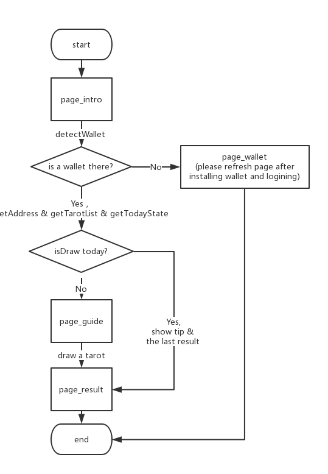

# nebulas-tarot

星云占星屋

## Install

``` bash
yarn install
http-server
```

## FlowChart



## Todo-List

- [x] Design & Dev basic version, then save it as branch-common
  - Page
    - Content
      - Page_intro
      - Page_content
        - part_guide
        - part_loading
        - part_result
      - Page_wallet
    - History
      - Page_table
      - Page_detail
    - Withdraw
    - About
  - [x] Method
    - [x] common
      - [x] getTarotList
      - [x] getTodayState(wait for @storage)
      - [x] drawTarotNum
      - [x] renderTarotByNum
    - [x] page
      - [x] initIntro
      - [x] initContent
      - [x] initWallet
  - [x] Tip of Repeated Draw (Show for two seconds)
- [ ] Design Contract and test in the testNet
  - [ ] Chain Storage
    - object: address, num, createtime
    - Method
      - save(object)
      - getData(address)
  - [ ] Contract
    - DrawItem
      - constructor: num & createdate & address
      - prototype:   toString
    - DrawContract
      - LocalContractStorage
        - defineProperty: ownerAddress(default) & drawTotal(BigNumber)
        - defineMapProperty: arrayMap(default) & dataMap(DrawItem)
      - prototype
        - init (ownerAddress->Blockchain.transaction.from, drawTotal->0)
        - _isOwner
        - setOwner 【for owner】
        - getOwner
        - withdraw 【for owner】
        - save
        - getData
        - getDrawTotal
        - transaction 【ToDo: To study】

- [ ] Test
  - [ ] System Stability
    - [ ] Method
    - [ ] Operate
  - [ ] Contract
    - [ ] 切换module
    - [ ] 正常抽牌
- [ ] Mobile First
  - [ ] Wallet in mobile
    - [ ] 无法调用钱包插件的情况
      - [ ] Nebulas智能钱包下载页面
    - [ ] 墙内无法访问