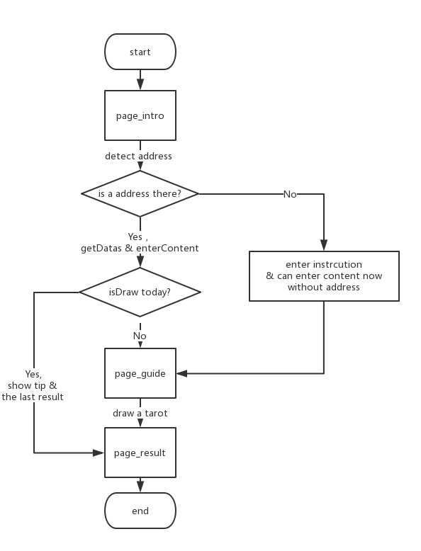

# nebulas-tarot 「星云塔罗屋」

「星云塔罗屋」是基于星云3.0公链的塔罗牌抽取DApp应用（现已完成移动端抽牌支持），用户所有塔罗牌抽取信息都会被存储于星云链上，数据全部真实有效且无法篡改和撤销。每人每天可以抽取一张塔罗牌，结合塔罗的指引为实际生活的疑惑做出一定的解读。

## Install

``` bash
yarn install
npm start
```

## FlowChart



## Effect diagram

- [效果图](./effect_pic)

## DevList

- Design & Dev basic version
- Design Contract and test in the testNet
- DApp online

## TodoList

- [Todo-List](Todo-List.md)